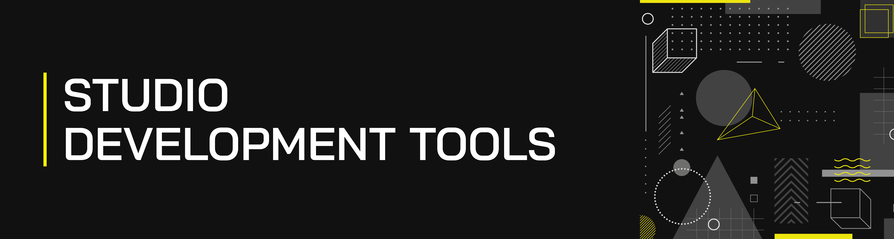

> Here at [Cyber Octane](http://www.cyberoctane.com/), we use following tools to optimize our day-to-day studio workflow.

## Code Editors
>Code editor is doing another big impact on our studio practice. After playing with different code editors in several years we have stick in to [`Visual Studio Code`](https://code.visualstudio.com/).

#### VS Code Plugins
- [Live Server](https://marketplace.visualstudio.com/items?itemName=ritwickdey.LiveServer)
- [VScode Icons](https://marketplace.visualstudio.com/items?itemName=robertohuertasm.vscode-icons)
- [Beautify](https://marketplace.visualstudio.com/items?itemName=HookyQR.beautify)
- [Bracket Pair Colorizer](https://marketplace.visualstudio.com/items?itemName=CoenraadS.bracket-pair-colorizer)
- [JS & CSS Minifier (Minify)](https://marketplace.visualstudio.com/items?itemName=olback.es6-css-minify)
- [Debugger for Chrome](https://marketplace.visualstudio.com/items?itemName=msjsdiag.debugger-for-chrome)

#### VS Code Themes
- [One Dark Pro](https://marketplace.visualstudio.com/items?itemName=zhuangtongfa.Material-theme)

## Front-End Development
>As we highly concerning about pixel perfect designing we use & hope to use these tools to craft a stunning masterpiece.

### HTML/CSS

#### CSS Frameworks
- [Bootstrap](https://getbootstrap.com/) - A free and open-source CSS framework directed at responsive, mobile-first front-end web development.

#### Tools
- [HTML 5 Boilerplate](https://github.com/h5bp/html5-boilerplate)
- [Favicon Generator](https://realfavicongenerator.net/)

#### Resources
- [Media Queries for Standard Devices](src/media_queries_for_standard_devices.md)
- [Frontend Dev Bookmarks](https://github.com/dypsilon/frontend-dev-bookmarks) - Manually curated collection of resources for frontend web developers.
- [Design Resources for Developers](https://github.com/bradtraversy/design-resources-for-developers) - Manually Curated list of design and UI resources by [Brad Traversy](https://github.com/bradtraversy).

### Javascript

#### UI Frameworks
- [React](https://reactjs.org/) - An open-source JavaScript library for building user interfaces, backed by Facebook.
- [Vue.js](https://vuejs.org/) - An open-source model–view–viewmodel JavaScript framework for building user interfaces and single-page applications.

#### Resources
- [Awesome Javascript](https://github.com/sorrycc/awesome-javascript) - A collection of awesome browser-side JavaScript libraries & resources.

### JAMStack

#### Static Site Generators

- [Hugo](https://gohugo.io/) - A static site generator written in Go.
- [11ty](https://www.11ty.dev/)

## Back-End Tools
>The back-end is basically how the site works, updates and dealing with databases and servers. Usually we people who work on the back-end are mostly worried about things like security, structure and content management. To do such things we use [Python](https://www.python.org/) which is most trending on [GitHub](https://github.com/).

### Python

#### Package Managers
- [Pip](https://pypi.org/project/pip/) - A standard package-management system used to install and manage software packages written in Python.

#### Python Frameworks
- [Django](https://www.djangoproject.com/) - A Python-based free and open-source web framework that follows the model-template-view architectural pattern.

#### Resources
- [Awesome Python](https://github.com/vinta/awesome-python) - A curated list of awesome Python frameworks, libraries, software and resources.
- [Awesome Django](https://github.com/shahraizali/awesome-django) - A curated list of awesome Django apps, projects and resources.
- [Awesome Django 2](https://github.com/wsvincent/awesome-django) - A curated list of awesome things related to Django.

## In-Production

#### Module Loader/Bundler
- [webpack](https://webpack.js.org/)

#### Task Runner
- [Gulp](https://gulpjs.com/)

## Additional Tools

#### Icon Packs
- [Font Awesome](https://fontawesome.com/)
- [Ionicons](https://ionicons.com/)
- [icons8](https://formspree.io/)

#### Static Site Form Handlers

Free
- [Netlify Forms](https://docs.netlify.com/forms/setup/#html-forms)
- [Static Forms](https://www.staticforms.xyz/)
- [Kwes Form Builder](https://kwes.io/)
- [Formspree](https://formspree.io/)
- [GetForm](https://getform.io/)
- [FormBackend](https://www.formbackend.com/)
- [FormPlug](https://danielireson.github.io/formplug-serverless/)
- [FormSubmit](https://formsubmit.co/)
- [Formcake](https://formcake.com/) - Not mention any file uploading ability.

Paid
- [formX](https://formx.stream/index)
- [Formcarry](https://formcarry.com/)
- [Basin](https://usebasin.com/)
- [FormKeep](https://formkeep.com/)
- [FieldGoal](https://fieldgoal.io/)
- [Form2chat](https://form2chat.io/)

#### Free Stock Images/Illustrations
- [DrawKit](https://www.drawkit.io/) - A collection of free, beautiful, customisable MIT licensed illustrations.
- [Unsplash](https://unsplash.com/er) - Free photos.

#### Color Inspirations
- [COLOURlovers](https://www.colourlovers.com/) - A creative community where people from around the world create and share colors, palettes and patterns.

#### UI Inspirations
- [Awwwards](https://www.awwwards.com/) - 
- [CSS Awards](https://www.cssawards.net/) - A web designer inspiration gallery, where a high quality of CSS websites placed from around the world.
- [uplabs](https://www.uplabs.com/) - A community of creatives, offering the best digital inspiration and downloads, every day.

#### GitHub Tools

- [README-Template.md](https://gist.github.com/PurpleBooth/109311bb0361f32d87a2) - A template to make good README.
- [shields.io](https://github.com/badges/shields/) - GitHub legible badges in SVG and raster format.

## Additional Resources

- [Awesome List](https://github.com/sindresorhus/awesome) - A Curated list of awesome lists.
- [free-for-dev](https://github.com/ripienaar/free-for-dev) - A list of SaaS, PaaS and IaaS offerings that have free tiers of interest to devops and infradev.
- [List of Free Public APIs](https://github.com/toddmotto/public-apis) - A collective list of free APIs for use in software and web development.
- [Free Programming Books](https://github.com/EbookFoundation/free-programming-books) - A list of freely available programming e-books.
- [Frontend Developer Interview Questions](https://github.com/h5bp/Front-end-Developer-Interview-Questions) - A list of helpful front-end related questions you can use to interview potential candidates, test yourself.